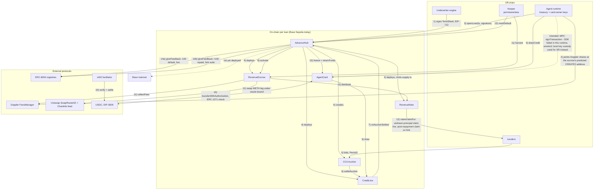

# Architecture

How Advance actually fits together: the contracts, the off-chain pieces that drive them, and why
three of the decisions a reviewer will question were made the way they were. For the checkable
evidence behind any claim here, see `docs/PROOF.md`.

## Loan lifecycle

**Legend.** Solid arrows are paths this system has actually exercised against real on-chain state:
either a mined Base Sepolia transaction (linked in `PROOF.md`) or the reproducible fork-test suite
running these exact contracts against live Base mainnet state (`cd contracts && FOUNDRY_PROFILE=fork
forge test`, also in `PROOF.md`) — both execute real bytecode against genuine external protocols,
neither is a mock. Dotted arrows are paths that are designed and coded for but not actually wired
end-to-end in this runtime.

Steps 1–9 and 13–14a ran live on Base Sepolia for all three seeded agents (`PROOF.md` → Agent
A/B/C). Step 10 ran live for both funded agents' x402 spend. Step 11 (harvest → distribute) ran live
26 times for Agent A, partially repaying its note; the cap-filling harvest that closes the escrow and
step 14b (the `+100` repaid feedback) were exercised on the fork suite, not yet on public Sepolia —
Agent A is still `Active` at 43.7% repaid by design (see `PROOF.md`), not because the closing path is
unproven. The CCA's failure branch — zero bids, `settleAuction` marks the loan `Failed`, the escrow
releases its shares back to the treasury — also ran live, visible as loans 1, 2, 3 and 6 on the same
hub from abandoned provisioning attempts; not diagrammed separately here for space.

## Trust boundaries

**What the contracts enforce, unconditionally, on-chain:**

- `AgentCard` can only ever pay its constructor-fixed payee allowlist, under a per-call cap and a
  bounded authorization window — checked by recomputing USDC's own EIP-3009 digest and comparing it
  to what was actually authorized, on every payment, regardless of what the agent's model was told
  to do. There is no generic execute and no owner withdrawal.
- `CreditLine.draw` can never exceed `drawLimit` in a `drawPeriod`; the refused over-limit draw in
  `PROOF.md` is this check, not a client-side courtesy.
- `RevenueNote` distributes strictly pro-rata and only up to its fixed cap; the cap can shrink
  (unsold notes burned at settlement) but never below what has already been repaid.
- `AdvanceHub`'s owner can rotate the underwriter signer or hand over ownership. Nothing else —
  no function lets the owner move a live loan's funds, change its terms, or pause it. Every keeper
  action (`harvest`, `settleAuction`, `markDefault`, `claim`) is permissionless, so there is no
  censorship point in the repayment or default path.
- Every call the escrow makes into a contract the term sheet merely *names* — the agent's pool
  token, the Doppler fees manager — runs on a bounded gas stipend with a bounded revert-data copy,
  so a hostile token can grief its own forwarding but cannot brick harvesting, closing or defaulting
  the loan. This is a fix, not an original design point: it is documented, with the finding it closes,
  in `docs/SECURITY.md`, and the deployed Sepolia bytecode includes it.

**What the runtime enforces (defense in depth, not a security boundary):**

- The gateway precheck refuses an obviously non-allowlisted payment client-side, before a signature
  is even requested — cheaper and faster than a round trip to the chain, but not the guarantee: it
  can be wrong, skipped, or bypassed entirely (as it deliberately was for the second refusal in
  `PROOF.md`) and nothing breaks, because the card checks again from first principles.
- The wallet's transaction-allowlist policy (synced live for every agent against the hub, the card,
  the fees manager and the identity registry) gates which *contracts and methods* a key may call. It
  does not, and structurally cannot cheaply, evaluate payment content — which payee, which amount,
  which authorization window. That check only exists on-chain, in the card.
- The underwriting engine's hard rules and credit-memo step decide whether to sign a term sheet at
  all. Once signed, `openLoan` verifies the signature and the term sheet's *shape* — ranges, pool
  eligibility, card getters — not the underwriter's judgment. A careless or compromised underwriter
  key can open a bad loan; it cannot touch an already-open loan's funds, and rotating it is one call.

**What a human must vet before signing, because nothing on-chain checks it:**

- That the named fees manager is the genuine Doppler deployment for that pool, not a lookalike.
- That the agent pool token is an unsurprising ERC20 (bounded gas stops a gas-bomb; it does not stop
  a token that mints itself unbounded supply or otherwise breaks the fee-accounting assumptions).
- That the `AgentCard` named in the term sheet is a known-good build — the hub only checks four
  getters (`hub`, `usdc`, `owner`, `payees`), not the card's actual bytecode, so "even a compromised
  owner key can only pay allowlisted payees" holds only if a human verified that before signing.
- That the agent treasury isn't at meaningful risk of a USDC blacklist mid-loan.

This list is the underwriter's real job description; the full version, with the audit finding each
line closes, is in `docs/SECURITY.md`.

## Underwriting data flow

`archive reads → formula → memo → evidence hash → signed term sheet → on-chain verification`

1. **Archive reads.** A recording chain reader queries the token's Doppler pool state, its lock
   beneficiaries, and up to 400 sampled swaps over a trailing 7-day window from an archive RPC.
   Every call is captured verbatim, so anyone with their own archive RPC can replay `rawReads` and
   recompute everything downstream independently.
2. **Formula.** Fee revenue over 1/7/30-day windows (in WETH and USD, via the same block's Chainlink
   read) and quality haircuts (holder concentration, wash-trading ratio, coefficient of variation) are
   computed as pure functions of the sampled reads — no LLM involved yet. Hard rules can already deny
   here (pool not WETH-paired, too young, no recent revenue, wash-traded, concentrated flow), which is
   most of the 36-scenario eval's deny cases.
3. **Memo.** Only once the hard rules pass, the formula's output plus the token's on-chain name and
   symbol go to an LLM for a human-readable credit memo. The merge step enforces one hard invariant in
   both directions: the memo can only tighten terms versus the formula's own output (cap down, floor
   up, draw limit down), never loosen them — including under a prompt-injection attempt embedded in
   token metadata. The eval asserts this at 0 violations across 36 scenarios, three of them adversarial.
4. **Evidence hash.** Every raw read, the formula's inputs and outputs, the LLM's exact request and
   response, and whichever rules fired are assembled into one bundle and hashed with `keccak256` over
   its RFC 8785 canonical JSON form. The hash changes if a single raw read changes.
5. **Signed term sheet.** The merged terms plus that hash (as `memoHash`) are assembled into the exact
   `TermSheet` struct the hub verifies, and EIP-712-signed by the underwriter key over the domain
   `{name: "Advance", version: "1", chainId, verifyingContract: hub}`.
6. **On-chain verification.** `openLoan` recovers the signer from the EIP-712 digest, checks it
   against the hub's stored `underwriter`, checks the nonce and that this exact term sheet hasn't
   already opened a loan, checks the term ranges/pool/card, and only then deploys the loan's
   contracts. The hub never re-derives the formula or re-asks the LLM — it verifies only that this
   exact signed structure came from the trusted key and fits its own sanity bounds. That is the
   trust boundary described above, made concrete.

## Where each sponsor primitive sits

- **Doppler `FeesManager` — the collateral.** The loan isn't collateralized by the agent token
  itself; it's collateralized by the pool's fee-beneficiary share, pointed at the loan's escrow at
  its predicted CREATE2 address before the loan even opens. `harvest` pulls the escrow's own accrued
  share directly from the fees manager's own accounting, so repayment is real pool revenue the
  manager itself attributes to the escrow, not a balance the protocol could inflate.
- **Uniswap CCA — price discovery.** The note (a fixed-supply IOU) is sold through a continuous
  clearing auction, not priced by the underwriter. The underwriter sets a floor and a minimum raise;
  the market sets the clearing price that actually funds the credit line. A borrower can self-fund
  their own auction to force graduation — economically a no-op, since the escrow just repays them —
  so graduation is evidence the auction mechanics work, not evidence of external demand.
- **USDC EIP-3009 + x402 — the spending rail.** The card never holds a spendable key of its own and
  never approves a spender; every payment is a `transferWithAuthorization` the card counter-signs
  on-chain via ERC-1271 against its own fixed allowlist and cap. x402 is the off-chain negotiation
  and settlement protocol wrapped around that same on-chain primitive — the rail's actual guarantee
  is USDC's authorization scheme, not trust in whichever facilitator relays it.
- **MPC wallet — key custody.** Intended to hold the agent's treasury and card-owner keys without any
  one machine ever holding the full key. In this runtime: key creation, EIP-712 typed-data signing,
  and the transaction-allowlist policy sync all ran for real, live, for every agent (the last one
  independently, over the same hub/card/fees-manager/identity-registry set each agent actually used).
  Raw transaction signing (`signTransaction`) failed reproducibly, across two different SDK dependency
  resolutions, with two different internal errors. Because an `AgentCard`'s owner must be one
  consistent signer for both `signTransaction` and `signTypedData`, that failure ruled the MPC path
  out for these operational keys entirely — not only for the calls that needed `signTransaction` — so
  every on-chain send and every x402 payment signature in the documented run used local key custody
  (the same interface, AES-256-GCM encrypted at rest) instead. The switch is one config value
  (`KEY_CUSTODY=local|dynamic`) precisely because the two are meant to be interchangeable once the
  upstream signing path is fixed.
- **ERC-8004 — reputation.** Every loan's outcome is posted once, on-chain, to the agent's identity:
  `+100`/`"repaid"` or `-100`/`"default"`. The post is deliberately one-shot and never retried, so a
  registry outage can delay a reputation update but can never block or duplicate a loan's actual
  outcome, and it is the only durable signal any future underwriter has about how this agent's past
  loans went.

## Three choices a reviewer will question

**Why the note carries accrued repayment with the token, instead of a fixed snapshot of who was
owed what.** The note isn't sold to a known list of lenders at open time — it's minted entirely to a
continuous auction contract and bidders exit and claim it at their own pace, sometimes well after a
harvest has already distributed repayment. A snapshot-based scheme would need to either iterate every
holder on every harvest or accept that a late claimant's notes were "already spent" by someone else's
snapshot. Instead the note runs a MasterChef-style accumulator, settled on both sides of every
transfer, so an unsold note still sitting in the auction accrues its pro-rata share exactly like a
claimed one, and that share simply travels to whoever the auction eventually pays out. Cost: O(1) per
harvest regardless of holder count. The one edge case this shape creates — notes sent to the auction
address *after* it has already paid out, which can then never be claimed — is guarded directly rather
than left implicit (`AuctionHolderCannotClaim`).

**Why the escrow holds the beneficiary role, instead of a pull-based claim on the agent's own
account.** Doppler's fee-beneficiary system is push-based: a beneficiary's shares live at whatever
address currently holds them, and fees pay out to whoever calls `collectFees` for that address. There
is no "claim against a registered beneficiary" primitive to pull from instead. Given that, the escrow
has to actually hold the role to collect permissionlessly. The obvious risk — the agent could point
their shares at one address while the hub deploys the loan at another — is closed with CREATE2
predict-then-pledge: `openLoan` computes the escrow's exact deployment address from the full
configuration and the term sheet's hash, and requires that address to already hold at least the
promised shares *before* deploying anything. Only the hub can ever deploy a contract at that address
(`EscrowDeployer` requires the caller to be the hub), so the address can't be squatted and there is no
window in which what was checked and what gets deployed could diverge.

**Why enforcement is on-chain rather than in the wallet policy.** A wallet's policy engine gates
*which contracts and methods* a key may call — it isn't built to cheaply and reliably evaluate a
specific payment's content: this exact payee, this exact amount, this exact authorization window.
Building that into a policy DSL means re-implementing the same check a second time, in a place that
isn't the contract actually moving the money, and trusting that reimplementation stays in sync.
Putting it on-chain instead means the guarantee holds no matter which wallet, gateway, or client
library requests the signature — which this deployment tested more directly than intended: it
survived swapping its entire key-custody backend (MPC to local keys, mid-project, for the reason
above) without changing what the card would or would not pay, because the payee and cap checks were
never in the wallet layer to begin with. The gateway and the wallet policy are real and both ran live
in this deployment; they are optimizations that fail fast and cheaply, not the guarantee itself.
